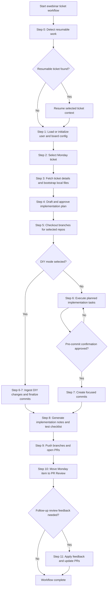

# ewebinar Skill Workflow Diagram

```mermaid
flowchart TD
    start[Start ewebinar ticket workflow] --> step0[Step 0: Detect resumable work]
    step0 --> hasResume{Resumable ticket found?}
    hasResume -->|Yes| resumeTicket[Resume selected ticket context]
    hasResume -->|No| step1[Step 1: Load or initialize user and board config]
    resumeTicket --> step1

    step1 --> step2[Step 2: Select Monday ticket]
    step2 --> step3[Step 3: Fetch ticket details and bootstrap local files]
    step3 --> step4[Step 4: Draft and approve implementation plan]
    step4 --> step5[Step 5: Checkout branches for selected repos]

    step5 --> diyFlow{DIY mode selected?}
    diyFlow -->|Yes| step67[Step 6-7: Ingest DIY changes and finalize commits]
    diyFlow -->|No| step6[Step 6: Execute planned implementation tasks]

    step6 --> preCommitConfirm{Pre-commit confirmation approved?}
    preCommitConfirm -->|Yes| step7[Step 7: Create focused commits]
    preCommitConfirm -->|No| step6

    step67 --> step8[Step 8: Generate implementation notes and test checklist]
    step7 --> step8

    step8 --> step9[Step 9: Push branches and open PRs]
    step9 --> step10[Step 10: Move Monday item to PR Review]
    step10 --> step11{Follow-up review feedback needed?}
    step11 -->|Yes| step11work[Step 11: Apply feedback and update PRs]
    step11 -->|No| endFlow[Workflow complete]
    step11work --> endFlow
```
